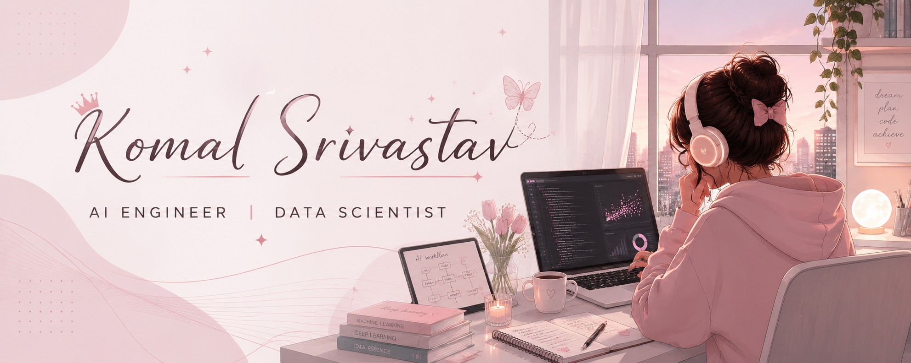

  

 

### AI Engineer • Data Scientist

---

### About

Building AI products with LLMs, RAG pipelines, machine learning, and data analytics while focusing on scalable backend systems and clean user experiences.

---

<table>
<tr>

<td width="50%">

### Featured Projects

- **FinSage** — AI Financial Advisor
- **Predictive Job Trend Analytics**
- **LLM + RAG Applications**
- **Business Intelligence Dashboards**

</td>

<td width="50%">

### Current Focus

- Generative AI
- Agentic Workflows
- Retrieval-Augmented Generation
- Data Analytics

</td>

</tr>
</table>

---

---

